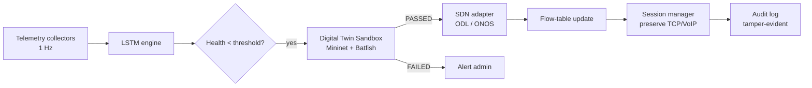

# QUICKSTART — for Meghana, Bharadwaj, Sricharitha

> Goal: get your first commit on GitHub in **20–30 minutes**, before the
> demo. Keep this page open while you go through it.

---

## ① Accept the GitHub invite (1 min)

Vineeth has added you as a collaborator on
`https://github.com/vineethkodakandla/PATHWISEAI`. Check email for an
invitation from GitHub and click **Accept invitation**. Or log into
GitHub → Notifications → accept.

If no email arrived, ping Vineeth — he can resend the invite from
Settings → Collaborators.

---

## ② Install the tools (5 min — skip if you already have them)

| Tool | Check command | Install if missing |
|---|---|---|
| Git | `git --version` | <https://git-scm.com/downloads> (Windows installer also installs Git Credential Manager) |
| GitHub CLI (`gh`) | `gh --version` | <https://cli.github.com/> — easiest cross-platform auth |

---

## ③ Authenticate to GitHub (5 min — only once per machine)

This is the step most likely to fail. Use **one** of these methods:

### Option A — GitHub CLI (recommended, cross-platform)
```bash
gh auth login
```
- Pick **GitHub.com**
- Pick **HTTPS**
- Pick **Login with a web browser**
- Copy the one-time code, paste it into the browser, click Authorize

`gh` will configure git too. You're done with auth.

### Option B — Git Credential Manager (Windows only, auto-installed with Git for Windows)
First push will pop a browser window asking you to log in to GitHub. Do
that once and credentials are cached. Nothing to set up in advance.

### Option C — Personal Access Token (manual, last resort)
Skip unless A and B both fail. Settings → Developer Settings → Tokens →
Generate new token (classic) → check `repo` → use that token as
**password** when git prompts you.

---

## ④ Clone and set your identity (2 min)

```bash
git clone https://github.com/vineethkodakandla/PATHWISEAI.git
cd PATHWISEAI

# CRITICAL: use a GitHub-verified email, otherwise contributions
# won't show on your contributor profile graph.
# Find it: GitHub → Settings → Emails

git config user.name  "Your Full Name"
git config user.email "your-verified-email@example.com"
```

To use your privacy-protected GitHub email instead of your real one,
go to GitHub → Settings → Emails → enable "Keep my email addresses
private" and use the `<id>+<username>@users.noreply.github.com` format
shown there.

---

## ⑤ Make your first real commit (15 min)

Pick the section matching your role. The content is **starter
material** — read it, edit it to reflect your actual understanding,
then commit. The commit MUST come from your machine under your
identity, not Vineeth's.

### Meghana (Requirements / ML)

Create `ml/README.md` and paste-then-edit:

```markdown
# PathWise AI — ML Pipeline

## LSTM Architecture
- Input shape: [batch, 60, 3]  (60 timesteps × {latency, jitter, packet_loss})
- 2× stacked LSTM, hidden_size=128, dropout=0.2
- Bahdanau attention over LSTM outputs
- Linear projection → [batch, 2, 3] (predictions at t+30s, t+60s)

## Training
- Optimizer: Adam, lr=1e-3
- Loss: MSE
- Batch size: 256
- Epochs: 50, early-stopping patience=5
- Train/val/test: 70/15/15

## Data Generation
Synthetic telemetry generated via Mininet on WSL2. Five scenarios:
gradual brownout, sudden loss spikes, jitter oscillation, multi-link
simultaneous degradation, link recovery after failover.

## Evaluation
Held-out test MSE: < TODO: fill in actual number from your run >.
Prediction accuracy ≥ 90% per Req-Qual-Perf-1.
```

Commit:
```bash
git add ml/README.md
git commit -m "Document LSTM architecture and training pipeline"
git pull --rebase origin main
git push origin main
```

### Bharadwaj (Design / Test)

Create `frontend/IBN_GRAMMAR.md` and paste-then-edit:

```markdown
# IBN Console — Supported Natural-Language Patterns

The IBN console accepts the following intent phrasings. Parser lives
in `server/ibn_engine.py`.

## Selective IP Degrade (time-bounded, narrow scope)
- "Throttle <app> to <N> kbps for <T> seconds"
- "Block <ip> for <T> minutes"
- "Degrade <app> for <T> minutes"

## App-level QoS (full-app, no time bound)
- "Throttle <app> to <N> kbps"
- "Prioritize <app> over <app>"
- "Give <app> maximum bandwidth"
- "Block <app>" / "Stop <app>"
- "Remove <app> restriction"

## Link-level policy
- "Prioritize <traffic-class> on <link>"
- "Ensure <metric> stays below <threshold> for <traffic>"
- "Redirect <traffic> from <src-link> to <dst-link>"

## Examples that work today
| Input | Parsed action |
|---|---|
| Prioritize VoIP on fiber | prioritize |
| Throttle YouTube to 500 kbps | throttle_app |
| Block 172.217.14.110 for 2 minutes | selective_degrade (block) |
| Throttle youtube to 300 kbps for 30 seconds | selective_degrade (throttle) |
```

Commit:
```bash
git add frontend/IBN_GRAMMAR.md
git commit -m "Document IBN console natural-language grammar"
git pull --rebase origin main
git push origin main
```

### Sricharitha (Config / Tech / SDN)

Create `docs/architecture.md` (`mkdir -p docs` first) and paste-then-edit:

````markdown
# PathWise AI — Steering & Sandbox Architecture

## Hitless-handoff steering pipeline



## Module ownership

- `server/sdn_adapter.py` — ODL + ONOS REST clients (Req-Func-Sw-5)
- `server/sandbox.py` — Mininet replica + Batfish loop/ACL check
  (Req-Func-Sw-8/9/10)
- `server/session_manager.py` — TCP session state (Req-Func-Sw-7)
- `server/routing.py` — flow-table apply / rollback
- `infra/mininet/` — virtual topology builder
- `infra/batfish/` — Batfish container

## Latency budget
- Sandbox validation: < 5 s (Req-Qual-Perf-3)
- Trigger → flow-table update: < 50 ms (Req-Qual-Perf-2)
````

Commit:
```bash
mkdir -p docs
git add docs/architecture.md
git commit -m "Add steering pipeline architecture diagram"
git pull --rebase origin main
git push origin main
```

---

## ⑥ Verify your commit landed (1 min)

```bash
git log --oneline | head -3            # your commit on top
git shortlog -sne HEAD | head           # you appear in the count
```

Or open in browser:
- <https://github.com/vineethkodakandla/PATHWISEAI/commits/main>
- <https://github.com/vineethkodakandla/PATHWISEAI/graphs/contributors>

---

## ⑦ If push is rejected ("non-fast-forward")

Someone else pushed first. Just rebase:
```bash
git pull --rebase origin main
git push origin main
```

If you hit a merge conflict (rare for the starter files since each
person's file is unique), edit the file to keep both versions, then:
```bash
git add <file>
git rebase --continue
git push origin main
```

---

## ⑧ Make a second commit if you have time

After your first commit lands, pick from `TEAM_ONBOARDING.md` Step 3
(your section) for ideas. Even a small README addition or one new
unit test counts.

---

## What NOT to do

- Don't run `git config user.name` / `user.email` to anyone else's
  identity. That's impersonation.
- Don't paste a teammate's commit content under your name.
- Don't commit huge binary files (`.pkl`, ML checkpoints over 100 MB)
  — GitHub will reject them.

If something goes wrong, message Vineeth before pushing destructive
commands like `git reset --hard` or `git push --force`.

---

*Authored by Vineeth · 2026-04-27*
